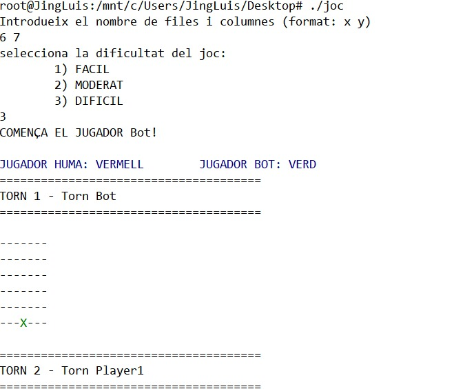
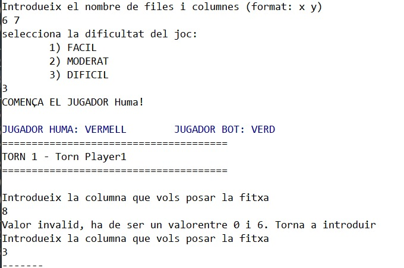
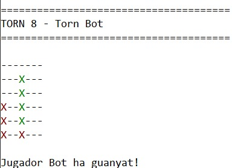

# LP-Practica
Pràctica de l'assignatura LLENGUATGE DE PROGRAMACIÓ 


## Introducció 🚀
Aquesta pràctica simula el joc quatre en ratlla on l'usuari pot jugar amb un Bot seleccionant la dificultat desitjada (fàcil, moderat i difícil) fent servir el llenguatge de programació **Haskell**. 
La descripció del joc ho teniu en el següent link: [Quatre en ratlla](https://en.wikipedia.org/wiki/Connect_Four). En aquesta versió es tria aleatòriament qui comença(jugador i bot) i es pot especificar la mida del tauler.


### Prerequisits 📋

_Per poder executar el codi, s'ha de tenir instalat GHC per poder executar codis de Haskell i s'ha d'importar `System.Random`. En Mac:_

```bash
> brew install cabal-install
> cabal update
> cabal install --lib random  
```

En Ubuntu:

```bash
> sudo apt install cabal-install
> cabal update
> cabal install random
```
_Aquest programa també inclou la llibreria `Data.List`. Els que no ho tingueu també s'ha d'importar._

## Compilació 🔧

_Per compilar el programa simplement has d'accedir al directori del fitxer i executar la següent comanda:_

```bash
> ghc joc.hs
```

## Execució ⚙️
_Per l'execució del programa has d'introduïr la següent comanda en el directori del fitxer compilat:_

```bash
> ./joc
```
_Un exemple d'execució seria:_

 

## Tutorial 📑
_Aquest programa permet el jugador enfrontar-se amb un dels bots dissenyats, concretament són els següents_

* Fàcil (el Bot escolleix una columna a l'atzar)
* Moderat (el Bot usa l'estratègia greedy)
* Difícil (el Bot usa l'estratègia minimax)

_Un cop escollida la mida del tauler i el nivell del Bot, l'usuari només ha d'introduir en cada moment la columna on vol posar la fitxa. No cal amoïnar-se si s'equivoca sense voler o no perquè el programa l'indicarà._
 
_En tot moment es veurà el tauler actualitzada i al final de la partida(empat o hi ha un guanyador) es mostrarà en forma de missatge_.
 
## Construït amb 🛠️

* [Haskell](https://www.haskell.org) 

## Autor ✒️
* **Jing Luis Cao**

## Referències 📄
* [How to build a perfect AI for Connect 4](http://blog.gamesolver.org/solving-connect-four/01-introduction/) - Per l'estrategia smart
* [Haskell References](http://zvon.org/other/haskell/Outputglobal/index.html) - Per dubtes sobre funcions de Haskell
